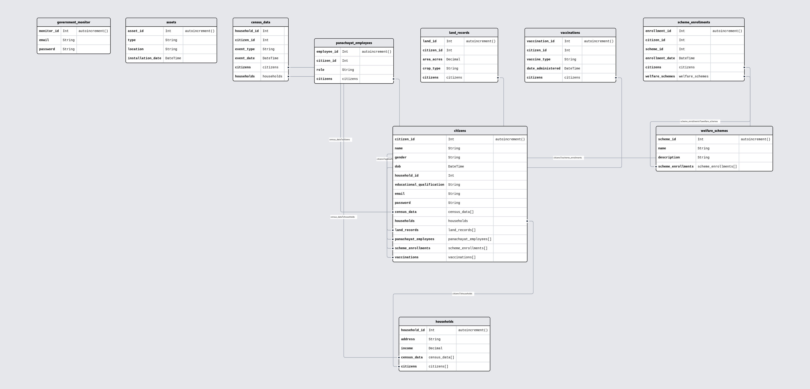

# DBMS Group Project

## Group Members
- [] Sumit Kumar 22CS30056
- [] Aviral Singh 22CS30015
- [] Mayash Nayak  22CS30064


# Next.js Project with Prisma

This project uses Next.js for the frontend and Prisma for database management. Below is a list of commands that help manage and interact with the database.

## Commands

### 1. **`make install`**

This command installs all dependencies and generates the Prisma Client.

```bash
make install
```

### 2. **`make dbpush`**

This command pushes the Prisma schema changes to the database and regenerates the Prisma Client.

```bash
make dbpush
```

### 3. **`make dbpull`**

This command pulls the current schema from the database and regenerates the Prisma Client.

```bash
make dbpull
```

### 4. **`make run`**

Starts the Next.js development server.

```bash
make run
```

### 5. **`make studio`**

Launches Prisma Studio, a UI to interact with your database.

```bash
make studio
```

### 5. **`make seed`**

Feed some default entries into the database for testing purposes.

```bash
make seed
```

## Additional Information

- **Prisma Studio**: A visual editor for your database to view and edit data.
- **Database Synchronization**: Use `dbpush` and `dbpull` to ensure the Prisma schema is aligned with your database state.
- **Next.js Development**: The `run` command will start the Next.js development server on `http://localhost:3000`.

---

## Prerequisites

- Ensure you have Node.js and npm installed.
- Set up Prisma in your project and configure your database.

---

## Setup Instructions

1. Clone the repository.
2. Run `make install` to install dependencies.
3. Set up your `.env` file with the correct database connection string.
4. Use `make dbpush` to push any changes to your database.
5. Run `make run` to start the development server.
6. Run `make studio` to launch Prisma Studio.
7. Run `make seed` to seed the database with default entries.

The project is now set up and ready to use. You can start building your application with Next.js and Prisma.

## Schema Documentation

The schema documentation for the project is available [here](documents/schema.md).

## ER Diagram

You can view the ER Diagram for the database schema below:

